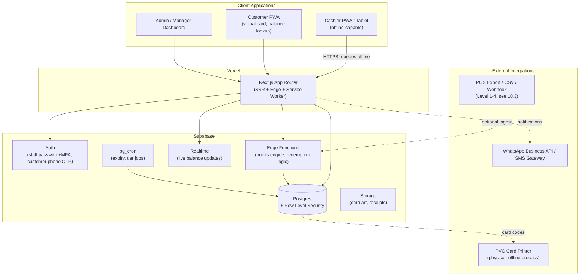
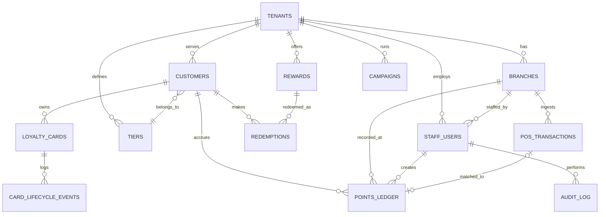
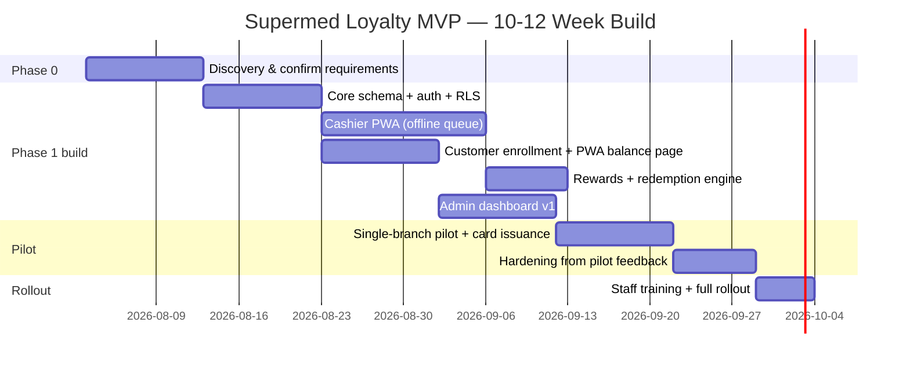

# Supermed Pharmacies — Loyalty & Customer Rewards Platform
### Software Design Document (SDD)

**Client:** Supermed Pharmacies, Bulawayo, Zimbabwe
**Prepared for:** Founder / Technical Lead (AI-assisted development team)
**Document type:** Architecture & product strategy brief, MVP → SaaS
**Target build window:** 10–12 weeks
**Version:** 1.0

---

## How to use this document

This is long because the brief asked for a real consulting deliverable, not a feature list. If you only read one thing, read the **Executive Summary** and **Section 3.4 (card technology decision)** — those two drive most of the downstream cost and architecture decisions. Everything else expands on *why*.

A companion file, `supermed_loyalty_schema.sql`, contains the full runnable Postgres/Supabase schema referenced in Section 11.

---

## 1. Executive Summary

Supermed asked for three things: loyalty cards, a customer database, and a rewards system. Underneath that request is really **one system** — a customer identity + points ledger + rules engine — with the card as merely the physical key that unlocks it. That distinction matters, because it changes where the money and time should go: mostly into the database and the cashier experience, and only lightly into the plastic.

**Core recommendations, up front:**

1. **Do not use magnetic stripe cards.** Print **QR + barcode** on the card instead (same printer, same cost, no encoder hardware, no failure mode from heat/wallets). Full reasoning in §3.4.
2. **Build standalone first (POS Integration Level 1), not integrated.** Nothing in the current Zimbabwean pharmacy POS landscape justifies API integration risk in a 10–12 week MVP. Full reasoning in §9 (POS section) and §10.3.
3. **Design multi-tenant from day one, even though day one has one tenant.** It costs almost nothing extra to add a `tenant_id` column and RLS policy now, and it is very expensive to retrofit later. This is what makes the Phase 3 SaaS pivot realistic instead of a rewrite.
4. **Ship a Progressive Web App, not a native app.** Given your stack (Next.js, Supabase, Vercel) and the fact that native distribution is explicitly not a priority, a PWA with offline queueing gets you 90% of the value for a fraction of the maintenance burden — and it works through Zimbabwe's load-shedding-driven connectivity gaps, which a server-dependent web app would not.
5. **Treat this as a regulated data project from day one.** Zimbabwe's Cyber and Data Protection Act [Chapter 12:07] applies to any business processing customer personal information, and pharmacies sit closer to "sensitive data" territory than a typical retailer. Building consent capture and audit logging in from the start is cheap; bolting it on after POTRAZ registration is due is not.

**What "MVP" means here:** one branch, cashier + manager + admin roles, QR/barcode-based enrollment, manual or CSV-based transaction entry (no live POS integration), a points and rewards engine, and a customer-facing balance lookup — all running on infrastructure that costs under $50/month. Everything else (multi-branch, tiers, campaigns, POS integration, white-labeling) is sequenced into Phase 2 and Phase 3 so you can sell the *next* phase instead of being asked to build it for free.

---

## 2. Business Analysis

### 2.1 Why loyalty matters differently for a pharmacy

A pharmacy's purchase pattern is not a café's. A meaningful share of pharmacy revenue is **recurring, necessity-driven** purchases (chronic medication, baby products, toiletries) rather than discretionary treat purchases. That changes what "loyalty" should optimize for:

- **Retention over acquisition** — the real prize is making sure a customer who already has to buy their blood pressure medication somewhere buys it *here* every month, not converting new walk-ins.
- **Trust and privacy sensitivity** — customers hand over phone numbers and, implicitly, information about their health needs. This pushes the design toward minimal data collection and clear consent, not toward the invasive segmentation a fashion retailer might do.
- **Lower margin tolerance** — pharmacy margins are thinner than general retail, so the reward economics (points-to-cost ratio) need to be modeled conservatively, not copied from an F&B loyalty template.

### 2.2 Critiquing the brief (as instructed)

Three assumptions in the original ask are worth pushing back on before building anything:

- **"Loyalty cards" as the starting point.** The card is the least valuable and most replaceable part of this system. If the founder had to cut something under time pressure, it should be the physical card, not the database or the cashier workflow. Recommendation: launch enrollment via phone number + QR code shown on the customer's phone (a "virtual card"), and treat the physical PVC card as a **fast-follow**, not a blocker — order it in parallel, but don't let card production lead time gate the software launch.
- **"There is already a company available that prints PVC cards with magnetic strips."** This sounds like a decision already made, but it's actually just a vendor relationship already made — the same vendor can almost certainly print barcode/QR cards instead, at the same or lower cost, since magnetic-stripe encoding is normally an add-on line item, not a discount. Don't let vendor inertia dictate the card technology.
- **Timeline vs. scope tension.** The brief asks for a 2–3 month MVP *and* a fully speced enterprise SaaS platform (multi-tenant, white-label, subscription billing, API-first, POS integrations across Southern Africa). Those are not the same project. This document specs both, but explicitly sequences the SaaS ambitions into Phase 2/3 so the MVP stays shippable in the stated window. Resist the temptation to build Phase 3 infrastructure "just in case" during Phase 1 — the multi-tenant schema gets you 90% of that future-proofing for near-zero extra effort; bespoke billing, white-labeling, and public APIs do not, and building them now with one customer and no revenue is the classic way an MVP misses its window.

### 2.3 Stakeholders

| Stakeholder | Primary need |
|---|---|
| Supermed owner/management | Visible ROI, low operating cost, minimal staff retraining |
| Pharmacy cashiers/pharmacists | A workflow that adds under ~10 seconds per transaction |
| Customers | Simple enrollment, clear balance visibility, real rewards |
| Founder (you) | A codebase that survives the jump from 1 client to N clients without a rewrite |

### 2.4 Success metrics (define before launch, review monthly)

- Enrollment rate (% of transactions with a loyalty card scanned)
- Repeat-visit rate lift for enrolled vs. unenrolled customers (needs a baseline period before rollout)
- Redemption rate (% of earned points actually redeemed — a program with near-zero redemption is a red flag, not a win)
- Average basket size, enrolled vs. unenrolled
- Cost of points issued as % of revenue (target: keep this under 2–3% initially; tune from real data, not guesswork)

---

## 3. Market Research

### 3.1 The Zimbabwean/Southern African POS landscape

There is **no dominant, standardized pharmacy POS system** in Zimbabwe. The market is a mix of: generic cloud POS tools positioned at all retail verticals including pharmacies (e.g. SalesPlay, marketed specifically on multi-currency USD/ZWG support and offline mode); locally built and sold POS boxes and tablet kits sold informally (Facebook Marketplace-style listings, own-brand installs by small local IT vendors); pay-once desktop POS software (e.g. "Smart POS Software," sold as a lifetime-license alternative to subscriptions); and dedicated pharmacy-management systems that bundle POS with prescription/inventory tracking (e.g. "Perfect Pharmacy Manager," which markets itself around prescriptions, inventory and patient records rather than loyalty).

**Implication:** you cannot assume Supermed's till system exposes an API, a webhook, or even a structured export. Some of these systems are barely more than a tablet running a spreadsheet-like interface. **Design for the worst case (no integration at all) and treat any integration you do get as a bonus**, not a dependency — this is exactly why POS Integration Level 1 (standalone) is the correct MVP target, expanded on in §9.

### 3.2 Infrastructure realities that should shape the architecture

- **Power.** Zimbabwe has experienced sustained load-shedding, with outages reported as long as 18 hours/day during 2024–2025 shortages driven by low Kariba dam levels and generation problems; state utility officials were projecting improvement into 2026 but this has been an on-and-off promise for years. **Assume intermittent power and connectivity as the default, not the exception.** This is the strongest possible argument for an offline-capable PWA over a server-dependent web app.
- **Mobile money is already the default payment UX.** EcoCash has over 5 million registered users and already offers **"Scan & Pay" QR codes** as a first-class feature in its consumer app. This is important: **QR-code scanning is not a new behavior you'd be teaching Supermed's customers — it's already how many of them pay for things.** A QR-based loyalty card rides an existing mental model instead of fighting one.
- **Connectivity for notifications.** WhatsApp (via Econet's ecosystem) and SMS are both viable channels; email is not reliable as a primary channel for a mass-market Zimbabwean retail customer base.

### 3.3 Regulatory context: Zimbabwe's Cyber and Data Protection Act

Zimbabwe's **Cyber and Data Protection Act [Chapter 12:07]** (enacted December 2021) governs how any business collects, processes, and stores personal information, with the **Postal and Telecommunications Regulatory Authority (POTRAZ)** acting as the data protection authority. Key obligations relevant to this platform:

- **Data controller licensing.** Since regulations introduced in September 2024, data controllers must register/license with POTRAZ and appoint a Data Protection Officer (even a small business needs someone formally designated in this role — realistically, the founder or a Supermed manager, at least initially).
- **24-hour breach notification** to POTRAZ is a hard legal requirement, not a best practice — this should be a documented runbook, not an afterthought (see §12.6).
- **Consent and data minimization.** Customers must be told clearly why data is collected; the system should only ask for what it needs (phone number, name — not national ID or date of birth unless there's a specific reward tied to it, like a birthday promotion).
- **Penalties are real.** Processing without the required license after the compliance deadline carries fines and, in serious cases, potential imprisonment for responsible individuals — this is not a "we'll deal with it later" risk.

This pushes the architecture toward: audit logging by default, an explicit consent-capture step at enrollment, minimal data collection, and a written breach-response process — all cheap to build in now, expensive to retrofit under regulatory pressure later.

### 3.4 Card technology decision (challenging the magstripe assumption)

| Technology | Unit cost (approx.) | Reader hardware | Durability in ZW climate/handling | Offline capable | Fraud resistance | Verdict for Supermed |
|---|---|---|---|---|---|---|
| **Magnetic stripe** | Similar to barcode/QR for the blank card, but stripe *encoding* is typically a separate paid step, and mag-stripe encoders/readers are a specialized, harder-to-source hardware category locally | Requires a dedicated mag-stripe reader (not the barcode scanners already common in local POS listings) | Poor — stripes degrade with heat, phone magnets, and wallet friction; Zimbabwe's climate is not kind to them | No inherent advantage | Low — trivially cloned with a $30 encoder | **Reject.** Adds cost and a hardware dependency for no benefit over barcode/QR. |
| **Barcode (linear or 2D)** | Cheapest — no special encoding step, same PVC printing process as any design | A standard USB barcode scanner (~$20–60, already a common line item in local POS bundles and ads) reads it instantly; a phone camera can also read most 2D formats | Excellent — printed ink under lamination, no moving parts | Yes — fully offline, no network needed to *read* the code | Moderate — codes can be photographed/shared, but so can any static code; mitigated with per-customer rotating tokens if needed later | **Primary fallback / legacy-scanner compatibility.** |
| **QR code** | Same cost as barcode | Any smartphone camera, or the same barcode scanners (most modern USB scanners read QR too) | Excellent, same as barcode | Yes | Moderate, same caveats as barcode; can encode a signed token to prevent copy-paste reuse | **Primary technology.** Matches the EcoCash "Scan & Pay" UX customers already know. |
| **RFID** | Meaningfully higher per-card cost (embedded chip/inlay); printing vendors treat it as a premium option | Needs a dedicated RFID reader — not something already sitting at a Zimbabwean pharmacy till | Good | Yes, but adds a hardware procurement dependency | Higher (harder to clone than a printed code) but overkill for this threat model | **Not justified for v1.** Revisit only if physical access-control use cases emerge (e.g., staff clock-in). |
| **NFC** | Higher than barcode/QR (chip inlay cost) | Modern Android phones have NFC built in, but this still requires either a phone-tap flow at every till or a dedicated reader | Good | Yes | Higher than QR (native to the physical chip) | **Phase 2/3 enhancement, not v1.** Interesting later as a phone-native "tap to check balance" feature once volumes justify the extra card cost. |
| **Hybrid (print both barcode + QR on one card)** | Marginal cost over a single code — most PVC printers charge per card, not per code printed on it | Works with either scanner type or a phone | Excellent | Yes | Same as above | **Recommended card format.** |

**Recommendation:** print a **QR code (primary) plus a linear barcode (fallback)** on the same PVC card, and treat the **phone-based QR "virtual card"** (shown in the customer PWA or sent via WhatsApp) as equally valid — a customer should be able to use either, and staff should be able to look someone up by phone number if they have neither on them. Go back to the existing PVC card vendor and simply request this print spec instead of magnetic-stripe encoding; the reasoning above should also protect Supermed from paying for a service (mag-stripe encoding) that adds cost and fragility without adding capability.

---

## 4. Competitive Analysis

| Platform | Strength | Weakness for Supermed's context | Approx. pricing (2026) | What to borrow |
|---|---|---|---|---|
| **Loyverse** | Free core POS + loyalty; simple points UX; widely used by small emerging-market retailers | POS lock-in; loyalty is a feature of *their* POS, not a standalone layer you can bolt onto whatever till Supermed already uses; add-ons ($5–25/store/month) still add up | Free core; Employee Mgmt $5/employee/mo; Advanced Inventory $25/store/mo | The "generous free tier, paid add-ons for depth" pricing philosophy |
| **Square Loyalty** | Clean checkout-embedded enrollment; tiered rewards | Requires Square POS (not used in Zimbabwe in any meaningful way); no offline mode; USD-only pricing model doesn't translate to a micro-margin pharmacy | ~$45–49/location/month, bundled into a Square Plus plan | Frictionless phone-number enrollment at checkout |
| **Smile.io / Shopify loyalty apps** | Strong e-commerce loyalty mechanics (VIP tiers, referrals, points expiry) | Built for Shopify order-volume billing (charges scale with monthly orders, not branches) — a poor fit for a low-online, in-store-first pharmacy; free tier caps out fast and paid tiers ($79–999/month) are priced for DTC e-commerce margins, not a Bulawayo pharmacy | Free (200 orders/mo) → $999/mo Plus tier | Clear tier/VIP structuring as a Phase 2 feature |
| **Lightspeed Retail** | Mature omnichannel retail features | Enterprise-oriented pricing and onboarding; global POS lock-in; not something a single-branch pharmacy in Bulawayo would realistically adopt | Enterprise-tier, quote-based | Multi-location inventory-aware loyalty as a longer-term pattern |
| **Toast** | Strong restaurant-specific loyalty/ordering | Restaurant-vertical only; irrelevant use case overlap | Restaurant-tier pricing | Not directly applicable |
| **Retail Pro / Oracle Retail Customer Engagement / SAP Customer Loyalty** | Enterprise-grade, handles millions of customers and complex coalition loyalty | Wildly out of scope: implementation costs commonly cited in the tens of thousands to **low millions of dollars** for mid-size to large retailers, with 3–24 month implementation timelines — this is not a "maybe later," it's simply the wrong category of tool for an SME pharmacy | Custom/quote-based; small-to-mid retailers researched at $60K–$500K first-year cost | Nothing — cited here only so the client understands why "just buy an enterprise system" isn't a real option at this budget |
| **Open Loyalty (open source, PHP/Symfony)** and **Odoo loyalty modules (community + paid)** | Free/cheap, self-hostable, transparent data model | Neither is built around your existing Next.js/Supabase/Vercel stack; adopting either means learning and hosting a second stack instead of extending the one you already know | Free (self-hosted) to low-cost module fees | Validates that a lean, self-built points-ledger + rewards-catalog data model (what Section 11 specs) is a proven, sane approach — you're not reinventing a concept, just implementing it natively in your own stack |

**Bottom-line conclusion:** none of the mainstream SaaS loyalty tools fit because they are priced for USD e-commerce order volumes or bundled into a specific POS you won't be using, and none of the enterprise suites are remotely appropriate at this budget. Building a lean, purpose-built system on a stack you already control is the correct call — not because "build vs. buy" is always the right instinct, but because *nothing evaluated actually solves the standalone, offline-tolerant, dual-currency, low-ARPU problem Supermed has.*

---

## 5. Recommended Technology Stack

Reuses your existing toolchain and the architectural patterns from Zotix wherever they transfer cleanly.

| Layer | Choice | Why |
|---|---|---|
| Frontend framework | Next.js (App Router) + TypeScript | Already your default; supports PWA tooling, SSR for the admin dashboard, and static/edge rendering for the customer-facing card page |
| UI | Tailwind CSS + shadcn/ui | Matches your existing design system muscle memory; fast to theme per §14 |
| Backend | Supabase (Postgres, Auth, Storage, Edge Functions, Realtime) | Same multi-tenant RLS pattern you've already used in Zotix — reuse the mental model, not just the vendor |
| Hosting | Vercel (frontend) + Supabase Cloud (backend) | Matches current skillset; CI/CD via GitHub |
| Offline layer | Service worker + IndexedDB queue (Workbox or a hand-rolled equivalent) | Required given §3.2's power/connectivity reality — this is the one genuinely new piece of engineering effort in the stack |
| Mobile wrapper | Capacitor — **deferred**, not day-one | Only worth it if/when you need an installable Android kiosk mode for a dedicated till tablet; the PWA covers the browser-based case first |
| Notifications | WhatsApp Business API as primary channel; SMS gateway (e.g. Twilio or an Africa-focused aggregator) as fallback | Matches how Zimbabwean consumers already communicate; avoid email as a primary channel |
| Validation | Zod | Shared schema validation between client forms and Edge Function inputs |
| Data fetching | TanStack Query | Handles the offline/retry/cache patterns this app needs almost out of the box |
| Analytics | Supabase-native SQL views/dashboards to start; PostHog if/when self-serve product analytics is worth the extra service | Don't add a third-party analytics vendor before you have enough usage to need one |
| Scheduled jobs | Supabase Edge Functions + `pg_cron` | Nightly jobs: points expiry, tier recalculation, low-activity nudges |

**Multi-tenancy model:** a **shared schema with a `tenant_id` column on every business table, enforced by Postgres Row Level Security**, not a schema-per-tenant or database-per-tenant approach. Shared-schema RLS is cheaper to run, far easier to migrate (one migration applies to all tenants at once), and is the natural extension of the Supabase idioms you already use — schema-per-tenant only starts paying for itself at a scale (dozens+ of large tenants with very different compliance needs) that is not this project's near-term reality.

---

## 6. Product Roadmap

| Phase | Timeframe | Scope | Business goal |
|---|---|---|---|
| **Phase 0 — Discovery** | Week 1–2 | Confirm branch count, till hardware, brand assets, reward economics | De-risk before writing code |
| **Phase 1 — MVP** | Week 3–10 (fits the 2–3 month target) | Single branch, standalone loyalty, QR/barcode cards, manual/CSV points entry, core rewards engine | Prove the concept, impress the client, generate real usage data |
| **Phase 2 — Multi-branch & depth** | Month 3–6 post-launch | Multi-branch, tiers, campaigns, semi-integrated POS (Level 2), analytics dashboard, card lifecycle automation | Turn a working pilot into a program Supermed depends on |
| **Phase 3 — SaaS** | Month 6–12+ | Multi-tenant self-serve onboarding, white-labeling, billing, public API, POS Level 3/4 partnerships, other retailers | Turn the codebase into a product business |

---

## 7. MVP Scope (Phase 1)

**In scope:**

- Single branch, single currency-of-record (with the ability to record USD or ZWG per transaction — see schema)
- Roles: Owner/Admin, Manager, Cashier
- Customer enrollment via phone number (OTP or manager-assisted), consent capture
- QR + barcode virtual and physical card issuance
- Cashier workflow: scan or manual phone-number lookup → enter transaction amount → points calculated and applied
- Points ledger (earn, redeem, manual adjustment with reason code + manager approval)
- Rewards catalog (fixed set defined by Supermed: e.g., "$2 off," "free item," "10% off")
- Redemption flow at till
- Customer-facing balance lookup (PWA page, no login required beyond phone+OTP)
- WhatsApp/SMS balance and redemption confirmations
- Basic admin dashboard: enrollment count, points issued/redeemed, top customers
- Audit log for all points adjustments and card status changes
- Lost-card reporting and card freeze/replace flow (manual, admin-driven)
- Data Protection Act baseline compliance: consent capture, privacy notice, minimal data fields, audit trail

**Explicitly out of scope for MVP (do not build yet):**

- Multi-branch logic (schema supports it, UI does not need to expose it yet)
- Tiers/VIP status
- Campaigns/promotions engine
- Any live POS API integration
- Public API / partner access
- Billing/subscription logic
- White-labeling / theming per tenant
- Native mobile app

---

## 8. Phase 2

- Multi-branch rollout with branch-level reporting and stock-aware promotions
- Tier system (e.g., Bronze/Silver/Gold by rolling 12-month spend) with tier-specific rewards
- Campaign engine (time-boxed bonus-point promotions, birthday rewards, referral bonuses)
- **POS Integration Level 2** (semi-integrated): cashier keys the POS receipt total into the loyalty tablet, or a lightweight end-of-day CSV import reconciles transactions — see §10.3
- Fraud rules: redemption velocity limits, duplicate-scan cooldowns, flagged-customer review queue
- Card lifecycle automation: self-service lost-card reporting via WhatsApp, automatic point migration on replacement
- Manager-facing analytics dashboard (cohort retention, redemption rate trends, reward cost-to-revenue ratio)

## 9. Phase 3

- Self-serve multi-tenant onboarding (new retailer signs up, gets a branded instance in minutes)
- White-label theming (logo, color palette, domain) per tenant
- Subscription billing (Stripe for USD-denominated plans; a local aggregator such as Paynow for ZWG/EcoCash-based billing if serving very small Zimbabwean merchants)
- Public, versioned API + webhook system for partner POS vendors
- **POS Integration Levels 3–4** for retailers whose POS vendor is willing to build a real integration (see §10.3)
- Reward-partner marketplace (e.g., other local businesses co-funding cross-redeemable rewards)
- Expansion playbook to other Southern African markets (flagged in §24 — treat South Africa as a separate compliance project given POPIA and a far more mature competitive field, not a simple copy-paste expansion)

---

## 10. System Architecture

### 10.1 High-level architecture



### 10.2 Offline strategy (the part that actually matters given §3.2)

The cashier PWA must keep working through a power/connectivity gap and reconcile safely afterward:

1. Every points transaction is created client-side with a **client-generated idempotency key** (UUID) before it touches the network.
2. If offline, the transaction is written to an IndexedDB queue and the UI shows an optimistic "pending sync" state — the cashier is not blocked.
3. A service worker background-sync process retries submission once connectivity returns.
4. The server treats the idempotency key as a unique constraint on the ledger table (see `points_ledger.idempotency_key` in the schema) — a retried submission that already landed is a safe no-op, not a double credit.
5. Conflict resolution is last-write-wins at the row level, but because the ledger is **append-only** (balances are derived, never overwritten), there is no real "conflict" to resolve — only ordering, which the `created_at` timestamp plus server-side sequencing handles.

This is the single most important piece of non-obvious engineering in the MVP. It is worth doing properly even under time pressure, because a loyalty system that silently loses points during a power cut will destroy trust in the program faster than any missing feature.

### 10.3 POS integration levels

| Level | Description | What it requires | Recommended timing |
|---|---|---|---|
| **Level 1 — Standalone** | Loyalty runs entirely independently. Cashier manually keys the transaction amount into the loyalty tablet after ringing up the sale on the existing till. | Nothing from the POS vendor | **MVP.** Zero integration risk, works with any till Supermed has today or switches to tomorrow. |
| **Level 2 — Semi-integrated** | Cashier reads the total off the POS receipt (or the POS prints/exports a barcode encoding the sale amount) and scans/enters it into the loyalty system; or a nightly CSV export from the POS is reconciled against the ledger. | A POS that can print a scannable receipt code or export a daily CSV — check what Supermed's actual system supports before committing to this | Phase 2 |
| **Level 3 — Full API integration** | The loyalty engine calls or is called by the POS in real time via a documented API. | A POS vendor with a real, documented, stable API — not guaranteed to exist for whatever system Supermed ends up using | Phase 3, opportunistic |
| **Level 4 — Real-time synchronization** | Bidirectional, real-time sync (e.g., POS applies a loyalty discount at the till automatically based on live balance). | A committed technical partnership with the POS vendor | Phase 3+, only worth pursuing for a POS vendor with enough shared customers to justify the integration effort on both sides |

Do not commit Supermed to a POS switch just to enable a higher integration level — the standalone model is a legitimate, permanent operating mode for a business this size, not just a stepping stone.

---

## 11. Database Design

### 11.1 Entity-relationship overview



### 11.2 Core entities (abbreviated — full DDL in `supermed_loyalty_schema.sql`)

| Table | Purpose |
|---|---|
| `tenants` | One row per business (Supermed today; other retailers in Phase 3) |
| `branches` | Physical locations per tenant |
| `staff_users` | Cashiers/managers/admins, linked to Supabase `auth.users` |
| `customers` | Loyalty members; minimal PII by design |
| `loyalty_cards` | QR/barcode/virtual card codes, one customer can have multiple over time (replacements) |
| `card_lifecycle_events` | Issued/lost/frozen/replaced history per card |
| `tiers` | Bronze/Silver/Gold-style tier definitions (Phase 2) |
| `points_ledger` | **Append-only** source of truth for all point movements |
| `rewards` | Redeemable catalog items |
| `redemptions` | A completed reward claim, linked to a ledger debit |
| `pos_transactions` | Raw ingested sale records (manual/CSV/API), optionally matched to a ledger entry |
| `campaigns` | Time-boxed promotional rules (Phase 2) |
| `audit_log` | Who changed what, before/after, for every sensitive action |

### 11.3 Key design decisions

- **The ledger is append-only.** `customers.points_balance` is a denormalized, trigger-maintained cache for fast reads — but the ledger is always the source of truth and can rebuild that cache from scratch if it's ever in doubt. This is the same principle double-entry accounting uses, and it's what makes offline sync (§10.2), audits, and dispute resolution (§12) tractable.
- **`idempotency_key` is a unique constraint**, not just a nice-to-have field — this is what makes retried offline submissions safe.
- **RLS is enforced via a `tenant_id` claim in the JWT**, checked against every tenant-scoped table, so a bug in application code can't leak one tenant's customer list to another — the database enforces isolation even if the frontend doesn't.

---

## 12. Security

### 12.1 Authentication

- **Staff:** Supabase Auth with email/password + optional MFA for Admin/Owner roles; a fast **PIN-based re-auth** at the till for cashier actions (not a full login) to keep transactions under the ~10-second target.
- **Customers:** phone number + OTP (no password to remember, matches how EcoCash and most Zimbabwean consumer apps already authenticate).

### 12.2 Authorization

Role-based access control with four roles (Owner/Admin, Manager, Cashier, Customer), enforced both at the application layer and via Postgres RLS policies keyed off `staff_users.role` and `tenant_id` — see schema comments for the exact policy definitions.

### 12.3 Data protection

- TLS in transit and AES-256 at rest (Supabase defaults) — verify this explicitly rather than assuming, and document it for the Data Protection Act compliance file.
- **Data minimization**: collect phone number and name at minimum; make email, date of birth, and address optional and justified by a specific feature (e.g., birthday reward) rather than collected "just in case."
- Explicit consent capture and timestamp (`customers.consent_given_at`) at enrollment, with a plain-language privacy notice.

### 12.4 Fraud prevention

- Velocity checks: flag (not auto-block) redemption patterns that spike abnormally for one customer or one cashier.
- Duplicate-scan cooldown: reject the same card code being used twice within an implausibly short window.
- Manual points adjustments always require a **reason code + manager PIN**, logged to `audit_log`.
- Branch-consistency checks: flag a card used at a branch far from its usual pattern (useful once multi-branch ships in Phase 2).

### 12.5 PCI-DSS scope note

This system never touches card *payment* data (no card numbers, no payment processing) — it only touches loyalty identifiers and points. **PCI-DSS does not apply.** Treat customer PII with equivalent rigor anyway, because the Data Protection Act does apply.

### 12.6 Zimbabwe Cyber and Data Protection Act compliance checklist

- [ ] Register/license as a data controller with POTRAZ (per the September 2024 licensing regulations)
- [ ] Appoint a named Data Protection Officer (can be the founder or a Supermed manager initially)
- [ ] Written privacy notice, shown at enrollment
- [ ] Documented consent capture, timestamped per customer
- [ ] Written breach-notification runbook (POTRAZ must be notified within 24 hours of a confirmed breach — know who calls whom before you need to)
- [ ] Data retention policy (define how long an inactive customer's data is kept before deletion/anonymization)
- [ ] Data subject access/correction/deletion process (even a manual, admin-driven one is enough at MVP scale)

---

## 13. API Design

MVP-era API surface is intentionally small — most of the "API" is Supabase's auto-generated REST/GraphQL layer plus a handful of Edge Functions for logic that must be atomic and server-side.

| Endpoint (Edge Function) | Method | Purpose |
|---|---|---|
| `/functions/v1/enroll-customer` | POST | Create customer + first card, capture consent |
| `/functions/v1/record-transaction` | POST | Apply points for a sale; idempotent on client-supplied key |
| `/functions/v1/redeem-reward` | POST | Debit points, create redemption record, validate balance server-side (never trust client-calculated balances) |
| `/functions/v1/report-card-lost` | POST | Freeze card, log lifecycle event |
| `/functions/v1/replace-card` | POST | Issue new card, migrate balance, invalidate old card |
| `/functions/v1/customer-balance` | GET | Public-safe (rate-limited) balance lookup by phone + OTP |

**Phase 3 additions:** versioned public API (`/v1/...`) with per-tenant API keys, webhook subscriptions for POS partners, and OAuth-style scoped tokens for third-party reward-partner integrations. Don't build this until there's a second tenant who actually needs it.

---

## 14. Dashboard Designs

**Design language reference points:** Stripe Dashboard, Linear, Notion, Vercel, Supabase Dashboard. What they share, and what to copy: generous whitespace over dense grids, subtle 1px borders instead of heavy drop shadows, a mostly monochrome palette (grays + white/near-black) with **one** accent color used sparingly for primary actions and status, and a command-palette (`Cmd+K`) pattern for power users once the admin dashboard has enough surface area to need one.

**Suggested accent:** a deep teal or clinical green reads as "health" without tipping into a dated, clip-art pharmacy aesthetic — but align this with Supermed's actual brand colors once available; don't invent a palette that fights their existing signage and packaging.

### 14.1 Cashier dashboard
Single-screen, large touch targets, optimized for speed over information density: scan/lookup field front and center, customer name + balance shown immediately on match, a big amount-entry keypad, one confirm button. Everything else (history, settings) is one tap away, never in the main flow.

### 14.2 Manager dashboard
Branch-level view: today's enrollments, redemptions, flagged transactions needing review, staff activity summary. This is where manual point adjustments get approved.

### 14.3 Admin/Owner dashboard
Cross-branch rollup (once multi-branch ships): revenue-per-point-issued cost tracking, customer segments, campaign builder (Phase 2), card issuance queue, and the compliance checklist from §12.6 surfaced as a living document, not a one-time PDF.

---

## 15. User Flows

**Customer enrollment:** cashier or customer self-enters phone number → OTP sent → consent screen shown in plain language → card issued (virtual immediately; physical PVC card follows once printed) → welcome message via WhatsApp/SMS with balance (0) and how redemption works.

**Cashier workflow:** scan card or look up by phone → system shows customer name + current balance → cashier enters sale amount (or, in Phase 2, scans/keys the POS-provided total) → points calculated and shown before confirming → confirm → balance updates, confirmation sent to customer.

**Manager workflow:** reviews flagged transactions and manual adjustment requests → approves/rejects with a reason code → all actions logged to `audit_log`.

**Admin workflow:** onboards a new branch (Phase 2) or new tenant (Phase 3), configures rewards catalog and tier thresholds, reviews compliance checklist status, builds campaigns.

**Card lifecycle:** issued → active → (customer reports lost) → frozen → replacement issued, balance migrated from old card to new → old card permanently revoked (never reactivated, to close the fraud window of a "found" card being used after a replacement was already issued).

**Points adjustment:** any manual credit/debit outside the normal earn/redeem flow requires a reason code selected from a fixed list (e.g., "goodwill gesture," "system error correction," "promotional bonus") plus manager PIN, and is written to both `points_ledger` and `audit_log`.

---

## 16. Wireframes (ASCII)

**Cashier scan screen**
```
┌─────────────────────────────────────┐
│  Supermed Loyalty          [Cashier]│
├─────────────────────────────────────┤
│                                     │
│   [ Scan card or type phone # ]    │
│                                     │
│           ┌───────────┐            │
│           │  📷 SCAN  │            │
│           └───────────┘            │
│                                     │
│  Recent: Tanaka M. — 240 pts       │
│          Rudo C.   — 85 pts        │
└─────────────────────────────────────┘
```

**After scan — transaction entry**
```
┌─────────────────────────────────────┐
│  ← Back            Tanaka Moyo      │
│                     Balance: 240 pts│
├─────────────────────────────────────┤
│  Sale amount:                       │
│   ┌─────────────────────────────┐   │
│   │  $  1  2 . 5 0               │   │
│   └─────────────────────────────┘   │
│  Points to earn:        +13 pts     │
│                                     │
│      [ 1 ][ 2 ][ 3 ]                │
│      [ 4 ][ 5 ][ 6 ]                │
│      [ 7 ][ 8 ][ 9 ]                │
│      [ . ][ 0 ][ ⌫ ]                │
│                                     │
│        [   CONFIRM   ]              │
└─────────────────────────────────────┘
```

**Admin dashboard overview**
```
┌───────────────────────────────────────────────────┐
│  Supermed Admin        Branches ▾   [⌘K]   [Owner] │
├───────────────────────────────────────────────────┤
│  Today          This month        Program health   │
│  ─────────      ──────────        ──────────────   │
│  42 enrolled    1,120 enrolled    Redemption: 34%   │
│  318 pts issued 8,940 pts issued  Cost/rev: 1.8%    │
│  6 redeemed     140 redeemed      Flagged: 2        │
├───────────────────────────────────────────────────┤
│  Top customers          │  Recent activity          │
│  1. Tanaka M.  — 1,240   │  Rudo C. redeemed reward  │
│  2. Farai N.   — 980     │  New enrollment: +1       │
│  3. Nyasha T.  — 875     │  Manual adj. — approved   │
└───────────────────────────────────────────────────┘
```

---

## 17. Risk Analysis

| Risk | Likelihood | Impact | Mitigation |
|---|---|---|---|
| Power/connectivity outage mid-transaction | High | Medium | Offline-first PWA design (§10.2) |
| Older/non-smartphone customers can't use QR | Medium | Medium | Physical card + phone-number lookup fallback always available |
| Staff gaming manual points entry | Medium | Medium | Audit log, reason codes, velocity flags (§12.4) |
| POS vendor unwilling/unable to integrate | High (given §3.1 fragmentation) | Low | Standalone-first design means this was never a dependency |
| Currency volatility (USD/ZWG) distorts reward value | Medium | Medium | Store transaction currency explicitly; define reward values in the currency actually used at till, review monthly |
| Client budget uncertainty derails scope | Medium | High | Phase 1 scope (§7) is fixed and small; everything else is a paid follow-on, not a silent expectation |
| Data Protection Act non-compliance | Low if addressed now | High (fines, reputational) | Checklist in §12.6, built in from day one |
| Scope creep toward "the SaaS platform" before Supermed is even live | Medium | High | Explicit phase gating (§6); resist building Phase 3 infrastructure during Phase 1 |

---

## 18. Cost-Saving Recommendations

- Start on Supabase's free or entry Pro tier (~$25/month) and Vercel's free/Hobby or entry Pro tier — this MVP does not need enterprise infrastructure spend.
- Skip native app store distribution entirely for now; a PWA avoids Apple/Google developer fees and review cycles.
- Skip magnetic-stripe encoding hardware and services entirely (§3.4) — this alone likely offsets a meaningful share of card-production cost.
- Use WhatsApp Business API (has a free tier for conversational messages within response windows) as the primary notification channel before paying for an SMS gateway at volume.
- Reuse Zotix's existing component library, auth patterns, and RLS conventions rather than re-deriving them — the biggest cost saving available is *not re-solving problems you've already solved once*.
- Defer any POS integration spend (§9, §10.3 Level 2+) until there's real usage data proving the manual-entry workflow is actually the bottleneck — don't pre-pay for an integration nobody has asked for yet.

---

## 19. Future AI Opportunities

- **Churn nudges:** flag customers with no activity in N days and trigger an automated WhatsApp re-engagement message.
- **Personalized reward suggestions:** recommend the next-best reward based on redemption history rather than showing every customer the same static catalog.
- **Fraud anomaly detection:** once there's enough transaction history, a lightweight anomaly model can outperform hand-written velocity rules.
- **Campaign copy generation:** let a manager describe a promotion in plain language and have it drafted into campaign copy for review (human approval always required, never auto-published).
- **Conversational balance/rewards assistant over WhatsApp:** "What's my points balance?" answered by a bot instead of requiring the PWA — a nice fit for a market where WhatsApp is more habitual than app-switching.
- **Caution flag:** anything that touches medication refill reminders or health-adjacent nudges sits closer to regulated pharmacy practice and sensitive-personal-data territory under the Data Protection Act — treat this as a distinct, carefully scoped feature requiring pharmacist sign-off, not a casual loyalty-engine add-on.

---

## 20. Development Timeline



This fits inside the requested 2–3 month window with a couple of weeks of margin for the inevitable slippage in a first pilot.

---

## 21. Suggested Pricing Model

### 21.1 For the Supermed engagement itself
Given the client's budget is not yet known, structure the commercial conversation around two numbers rather than one fixed quote:

- A **one-time build fee** covering Phase 1 (scope exactly as defined in §7) — price this against your own time investment, not against enterprise loyalty-platform benchmarks from §4, which are irrelevant at this scale.
- A **low monthly hosting/support retainer** in roughly the $30–80/month range at MVP scale (Supabase + Vercel + notification costs + your ongoing availability) — transparent, and cheap enough that Supermed has no incentive to churn to a competitor's bundled loyalty tool.

### 21.2 For the future SaaS (Phase 3)
Benchmarked against the researched competitor pricing in §4 — Loyverse's add-ons at $5–25/store/month, Square Loyalty at $45–49/location/month, Smile.io starting at $79/month for Shopify-native brands — a regional SME market with a much lower ARPU ceiling than the US/EU market these tools are priced for justifies **undercutting meaningfully while preserving margin**, because your infrastructure cost per tenant on Supabase/Vercel is low:

| Tier | Suggested price | Included |
|---|---|---|
| Starter | ~$15–20/branch/month | Single branch, standalone (Level 1), core rewards |
| Growth | ~$40–60/branch/month | Multi-branch, tiers, campaigns, Level 2 POS support |
| Enterprise/Custom | Quote-based | Level 3/4 POS integration, white-label, dedicated support |

Treat these as planning anchors, not a final commercial decision — validate against real willingness-to-pay once Phase 2 usage data exists.

---

## 22. Deployment Strategy

- **Frontend:** Vercel, standard Next.js deployment, PWA manifest + service worker registered.
- **Backend:** Supabase managed Postgres. **Note on region:** Supabase does not currently offer an `af-south-1` (Cape Town) region for new projects despite repeated community requests — as of this writing, the nearest practical option is a European region (e.g., `eu-west-1`/Ireland or Frankfurt). Budget for the resulting ~150–250ms latency in your offline-first design (which is exactly why offline queueing matters as much as raw latency here) rather than assuming low-latency African hosting is available today.
- **CI/CD:** GitHub Actions → Vercel preview deployments per PR → manual promotion to production.
- **Environments:** staging and production as separate Supabase projects, never sharing data.
- **Card issuance rollout:** pilot with a small batch (~200 cards) before committing to a full production run (1,000–2,000+), so any print-spec issues (QR scan reliability, lamination quality) surface cheaply.
- **Offline testing checklist:** explicitly test full enrollment + transaction + redemption flows with network disabled before go-live — don't let this be discovered by a real cashier during a real outage.

---

## 23. Maintenance Strategy

- **Monitoring:** Vercel's built-in analytics/logs + Supabase's project logs; add Sentry (or equivalent) once there's a live paying pilot, for real error visibility beyond what platform dashboards show.
- **Backups:** rely on Supabase's automatic daily backups; upgrade to a plan with point-in-time recovery once real customer data volume makes a full-day loss window unacceptable.
- **Support expectations:** as a solo founder coordinating AI-assisted development, define response-time expectations you can actually meet (e.g., "next business day" not "24/7") — an honest, smaller promise kept beats an ambitious one broken.
- **Migrations:** all schema changes go through versioned Supabase migrations, applied to staging first — never hand-edit production schema.
- **Compliance review:** revisit the §12.6 checklist quarterly, not just at launch — POTRAZ's regulatory posture here is still actively evolving (licensing regulations only arrived in September 2024).
- **Documentation handover:** a short, plain-language operating guide for Supermed staff (how to issue a card, how to freeze a lost one, how to approve a manual adjustment) — this reduces support burden on you far more than any amount of extra polish in the admin UI.

---

## 24. Commercialization Opportunities Beyond Supermed

- **White-label to other Bulawayo/Harare pharmacies and independent retailers** — the multi-tenant schema (§5, §11) is what makes this a config change, not a rewrite, *if* the discipline of not building tenant-specific one-offs during Phase 1 is maintained.
- **Cross-vertical reuse** — the same points-ledger-and-rewards-catalog core applies cleanly to salons, hardware stores, and small supermarkets; pharmacy-specific framing (consent language, health-data caution in §19) is really just careful defaults, not hard-coded logic.
- **Embed rather than compete** — several of the Zimbabwean POS vendors surfaced in §3.1 (general retail cloud POS tools, locally-built systems) have no loyalty offering of their own; a "loyalty-as-a-feature" API partnership could be more valuable than trying to out-compete them on POS functionality you don't want to build.
- **Regional expansion** — treat Zambia and similar markets as closer analogues to Zimbabwe's regulatory/infrastructure profile than South Africa, which has a stricter, more mature data-protection regime (POPIA) and a far more saturated loyalty-tech market — sequence expansion accordingly rather than assuming "Southern Africa" is one homogeneous market.
- **Card-vendor partnership** — a referral or revenue-share arrangement with the existing PVC card printer (or a QR/barcode-capable alternative) turns a one-time vendor relationship into a recurring one as the platform scales to new tenants.
- **Coalition loyalty** — shared, cross-redeemable points across a handful of non-competing local businesses is a genuinely differentiated offering that none of the SMB-tier competitors reviewed in §4 provide — a credible long-term moat if the platform reaches multi-tenant scale.

---

## Sources consulted

Market/POS landscape: SalesPlay Zimbabwe, EllzTech, Smart POS Software, Sarutech ("Perfect Pharmacy Manager"). Competitor pricing: GetApp, Capterra, Software Advice, Rivo, subZwallet, Sway Loyalty, FaveCard, Loop.fans, PricingNow (Loyverse/Square/Smile.io coverage), ERP Research (Oracle/SAP retail pricing), Odoo Apps Store, Open Loyalty (GitHub). Infrastructure/regulatory: Global Press Journal and Zimbabwe Situation (load-shedding), EcoCash official site and app store listing, POTRAZ, Michalsons, Securiti, MISA Zimbabwe, DataGuidance (Cyber and Data Protection Act coverage). Card production: Emerald Print, CardPrinting.com, Cardflair (Zimbabwe), CQ Colorful. Infrastructure: Supabase documentation and public GitHub discussions on regional availability.

*All content above is original analysis and paraphrase; no text has been reproduced verbatim from any source.*
